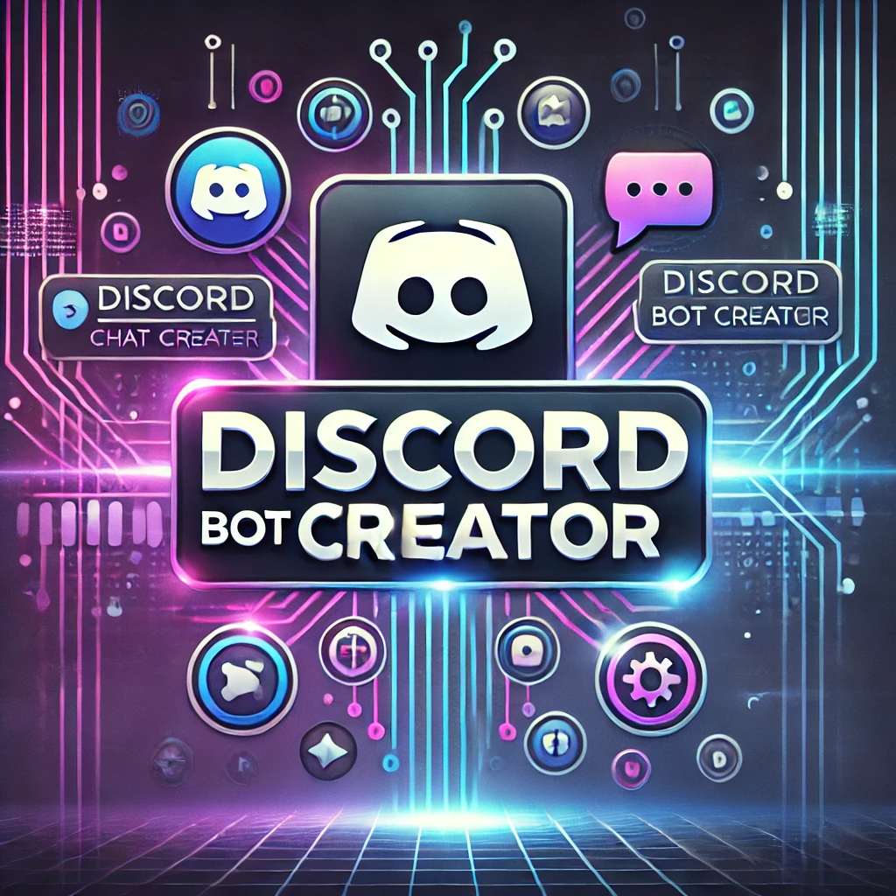

# 🤖 Discord Bot Creator Pro

<div align="center">
  
  
  [](https://github.com/Enyzelle/Discord-Bot-Creator/blob/main/LICENSE)
  [](https://github.com/Enyzelle/Discord-Bot-Creator/stargazers)
  [](https://github.com/Enyzelle/Discord-Bot-Creator/issues)
  [](https://discord.gg/ggsas)
</div>

## 📖 About

Discord Bot Creator Pro is a powerful shell script that helps you create feature-rich Discord bots in JavaScript (Node.js) or Python with just a few commands. It sets up a complete project structure with modern best practices, including command handlers, event systems, and more.

## ✨ Features

- 🎨 Beautiful CLI interface with colors and ASCII art
- 🔧 Support for both JavaScript (Discord.js) and Python (discord.py)
- ⚡ Advanced command & event handler system
- 🔥 Slash commands support
- 📝 Message commands support
- 📁 Organized project structure
- ⚠️ Error handling
- 🛠️ Configuration system
- 📚 Comprehensive documentation

## 🚀 Quick Start

1. Clone the repository:

```bash
git clone https://github.com/Enyzelle/Discord-Bot-Creator.git
cd Discord-Bot-Creator
```

2. Make the script executable:

```bash
chmod +x create_discord_bot.sh
```

3. Run the script:

```bash
./create_discord_bot.sh
```

4. Follow the interactive prompts to create your bot!

## 📋 Requirements

### For JavaScript bots:
- Node.js 22.12.0 or higher
- npm (Node Package Manager)

### For Python bots:
- Python Python 3.13.1 or higher
- pip (Python Package Manager)

## 🎯 Generated Project Structure

### JavaScript (Discord.js) Structure:
```
$botname/
├── src/
│   ├── commands/
│   ├── events/
│   └── index.js
├── config.json
├── .env
└── package.json
```

### Python (discord.py) Structure:
```
$botname/
├── cogs/
│   ├── general.py
│   └── events.py
├── utils/
│   └── config.py
├── bot.py
├── .env
└── requirements.txt
```

## 📚 Documentation

### JavaScript Bot Setup
1. Add your bot token to `.env`
2. Configure `clientId` and `guildId` in `config.json`
3. Install dependencies: `npm install`
4. Start the bot: `node src/index.js`

### Python Bot Setup
1. Create virtual environment: `python3 -m venv venv`
2. Activate virtual environment:
   - Windows: `venv\Scripts\activate`
   - Unix/MacOS: `source venv/bin/activate`
3. Install dependencies: `pip install -r requirements.txt`
4. Add your bot token to `.env`
5. Start the bot: `python bot.py`

## 🤝 Contributing

Contributions are welcome! Please feel free to submit a Pull Request. For major changes, please open an issue first to discuss what you would like to change.

1. Fork the repository
2. Create your feature branch (`git checkout -b feature/AmazingFeature`)
3. Commit your changes (`git commit -m 'Add some AmazingFeature'`)
4. Push to the branch (`git push origin feature/AmazingFeature`)
5. Open a Pull Request

## 📝 License

This project is licensed under the MIT License - see the [LICENSE](LICENSE) file for details.

## 💖 Support

If you find this project helpful, please consider:
- ⭐ Starring the repository
- 🐛 Reporting bugs
- 💡 Suggesting new features
- 🤝 Contributing to the code

## 📞 Contact

- Discord: yz_yuriza
- Email: enyz.contact@gmail.com
- IG: [@enyzelle](https://twitter.com/enyzelle)

## 🙏 Acknowledgments

- [Discord.js](https://discord.js.org/)
- [discord.py](https://discordpy.readthedocs.io/)
- All contributors who help improve this project

---
<div align="center">
  Made with ❤️ by Enyzelle
</div>
